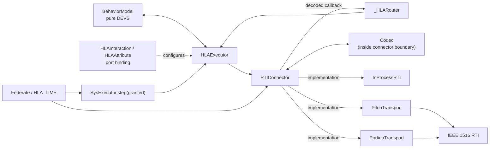
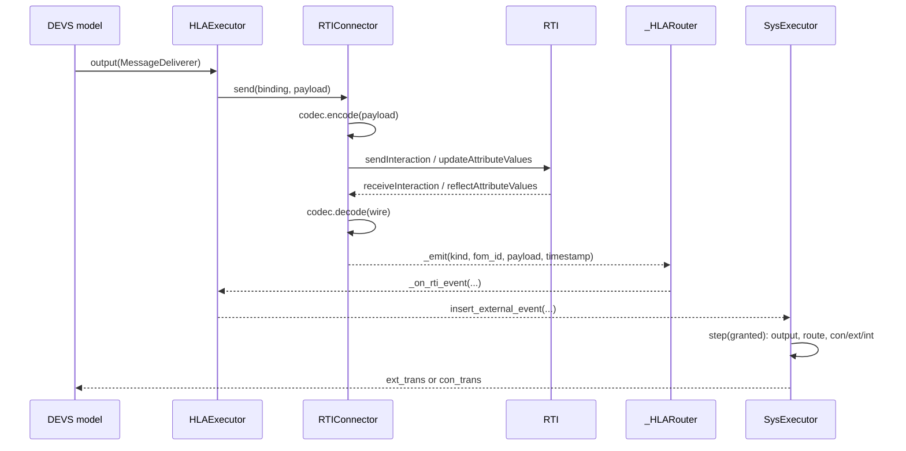

# HLA validation and reproducibility

This guide is the long-lived entry point for evidence behind pyjevsim's
HLA/RTI behavior. It keeps the architecture, validation criteria, reference
results, executable reproduction steps, and implementation boundaries beside
the source code they describe.

The record deliberately separates three kinds of evidence:

1. a hermetic comparison that anyone can run without Java or an RTI;
2. live interoperability checks that require Pitch pRTI or Portico; and
3. implementation-level unit tests for bindings, lifecycle, codecs, routing,
   time grants, and confluent events.

It does **not** claim IEEE 1516 conformance or HLA performance/scalability.
The implemented subset is listed in [IEEE 1516 service coverage](ieee1516-support.md),
and the relationship to other DEVS and DEVS/HLA systems is summarized in
[Related work and contribution boundary](related-work.md).

### Terms

- **DEVS**: Discrete Event System Specification.
- **HLA**: High Level Architecture for distributed simulation.
- **RTI**: Run-Time Infrastructure implementing HLA federation services.
- **FOM**: Federation Object Model defining exchanged classes and data.
- **TSO / RO**: timestamp-order / receive-order delivery.
- **JPype**: the Python-to-Java bridge used by the live RTI adapters.

### Release comparison

| Area | Published pyjevsim baseline (SoftwareX 2025) | Tagged `v2.1.2` | Post-`v2.1.2` development |
|---|---|---|---|
| Main focus | local Python DEVS execution and journaling | pluggable HLA connector, `HLA_TIME`, in-process tests, Pitch backend | Portico backend, AT/SIM equivalence protocol, committed traces, service/limitations record |
| Live HLA evidence | not part of the published contribution | Pitch 5.5.2 ping-pong, including a multiprocess synchronization-point path | adds Portico 2.1.4 and the two-scenario AT/SIM checks |
| Immutable identifier | article DOI `10.1016/j.softx.2025.102291` | tag `v2.1.2`, version DOI `10.5281/zenodo.21002029` | the next tagged release and archive are required; these changes are not contained in the v2.1.2 DOI |

The supported Python floor is consistently `>=3.10` in `pyproject.toml`, the
public README, and the documentation; CI exercises 3.10 and 3.13.

## 1. Architecture

An ordinary `BehaviorModel` remains independent of the selected RTI.  A binding
maps one of its named ports to a Federation Object Model (FOM) identifier;
`HLAExecutor` intercepts bound output, while `_HLARouter` injects received data
through the simulator's external-event path.



The binding is configuration supplied to `HLAExecutor`; it is not a hop in the
event data path.  Encoding and decoding occur inside the connector boundary.
The same model and binding dictionaries are used when the backend name changes.
Backend selection and the two required extension hooks are documented in
[`docs/hla/rti_interface.md`](../hla/rti_interface.md).

### Outbound and inbound workflow



## 2. Validation question and model

The validation asks a deliberately narrow question:

> Does the two-federate HLA execution reproduce the committed application-state
> trajectory of the single-`SysExecutor` reference for the same scenario?

The subject is the anti-torpedo example under [`examples/hla_atsim`](../../examples/hla_atsim/README.md):

| Item | Configuration |
|---|---|
| Reference | one `SysExecutor`, both platform models in one process |
| Distributed form | two `HLA_TIME` executors: `ship` and `torpedo` federates |
| Exchanged state | `HLAobjectRoot.Platform` attributes `id`, `kind`, `x`, `y`, `z`, `active` |
| FOM | [`AntiTorpedo.xml`](../../examples/hla_atsim/fom/AntiTorpedo.xml), IEEE 1516-2010 namespace |
| Scenarios | `self_propelled_decoy`, `stationary_decoy` |
| Horizon | 30 logical ticks; time resolution 1 |
| Time increments | grant increment 1 caller tick; default outbound timestamp offset 1 caller tick; Portico HLA regulating interval 1 internal RTI sub-step |
| Recorded artifact | sorted rows `(tick, object_name, x, y, z)` |
| Row count | 180 rows per execution and scenario |

Both builds use the same deterministic observation discipline:

- detectors read a frozen end-of-previous-tick position snapshot;
- objects are iterated by stable `sense_id`;
- physics is integrated at most once per tick; and
- cross-model decisions are committed at the next tick boundary.

Those rules remove Python set/hash iteration and intra-tick callback order from
the observed trajectory.  Their implementations are in
[`sensing.py`](../../examples/hla_atsim/utils/sensing.py) and
[`ticking.py`](../../examples/hla_atsim/utils/ticking.py).

AT/SIM validates object-attribute exchange with an explicit
`publish_local`/`ProxySink` pump between DEVS steps; it does not exercise a
bound DEVS uplink port.  The separate ping-pong example and tests exercise the
normal `HLAExecutor` binding path for both interactions and object attributes:

| Evidence path | Interaction | Object attribute | Binding path |
|---|---:|---:|---:|
| in-process and Pitch ping-pong | yes | yes | yes |
| Portico live smoke test | declaration/lifecycle only | no | binding metadata only |
| Portico and in-process AT/SIM trajectory comparison | no | yes | explicit between-step pump |

## 3. Behavioral-equivalence criterion

The criterion is exact equality of the canonical trajectory, not a numerical
tolerance:

1. record each live object's `(tick, sense_id, x, y, z)` at the end of a tick;
2. format each coordinate with Python's `"%.10g"` conversion;
3. sort the Python tuples (`tick` is an integer, so the primary order is
   numeric tick rather than lexicographic CSV text); and
4. require the same row count and exact tuple equality at every position.

[`verify_equivalence.py`](../../examples/hla_atsim/verify_equivalence.py)
compares both generated paths with the full committed traces in
[`results/`](results/), prints the first divergent pair, and exits nonzero on
a mismatch.  The live-RTI
variant, [`verify_equivalence_rti.py`](../../examples/hla_atsim/verify_equivalence_rti.py),
applies the same comparison to a subprocess-generated RTI trace.

### Timestamp and delivery-order scope

The compared timestamp is the committed pyjevsim tick.  The criterion does not
assert that raw RTI callback sequences are byte-identical:

- Pitch sends time-stamped updates and maps pyjevsim logical time 1:1 to RTI
  logical time.
- Portico reports receive-order delivery. Its backend buffers reflections and
  uses a three-sub-step barrier before exposing the tick snapshot. The barrier
  is designed to prevent next-tick over-read, but completeness of the
  current-tick batch depends on configurable `quiet`/`settle` wall-clock waits; a sufficiently
  late reflection can be exposed on the following tick.
- `InProcessRTI` grants a requested time immediately; the example driver advances
  both federates in explicit lock-step.

Consequently, equivalence means equal application-visible state at each committed
tick after each backend's documented ordering mechanism.  It applies to the Pitch
TSO path and to the Portico RO-plus-barrier path; it does not claim equality of
transport-internal arrival order.

## 4. Reproduction

### Offline gate (no Java or proprietary software)

From the repository root:

```bash
python -m pip install -e .
python -m pip install -r docs/hla-validation/requirements-validation.txt
python docs/hla-validation/results/verify_results.py
python examples/hla_atsim/verify_equivalence.py
```

Expected output:

```text
MATCH self_propelled: 180 rows
MATCH stationary: 180 rows
```

The workflow [`.github/workflows/validation.yml`](../../.github/workflows/validation.yml)
runs this gate on every push and pull request, in addition to the unit tests.

### Live Portico gate

```powershell
python -m pip install -e . -r docs/hla-validation/requirements-live-validation.txt
$env:PYJEVSIM_RTI = "portico"
$env:PYJEVSIM_JVM = "C:\path\to\jvm.dll"
$env:RTI_HOME = "C:\path\to\portico-2.1.4"
$env:PYJEVSIM_JAR = "$env:RTI_HOME\lib\portico.jar"
$env:RTI_RID_FILE = (Resolve-Path "docs/hla-validation/config/portico-jvm.rid").Path
java -version
(Get-FileHash $env:PYJEVSIM_JAR -Algorithm SHA256).Hash
python examples/hla_atsim/verify_equivalence_rti.py
```

Portico needs Java and JPype but no proprietary component or central RTI
process. The bundled RID selects `portico.connection = jvm` because this gate
runs two federates in one Python process/JVM. The Portico wrapper selects this
file when `RTI_RID_FILE` is unset, while preserving any explicit user value.
Multi-process or multi-host execution requires a different RID appropriate to
that transport and is outside this gate. Pitch uses the same driver with
`PYJEVSIM_RTI=pitch`, a
`prti1516e.jar`, and a running CRC.  Full setup is in the
[`hla_atsim` README](../../examples/hla_atsim/README.md#optional-live-rti-runs).
The live verifier is strict: absent Java/JAR support or a missing output trace
returns status 2. A successful result requires `MATCH` for both scenarios.
Each scenario subprocess has a 180-second watchdog by default, configurable
through `PYJEVSIM_LIVE_TIMEOUT`; this bounds the validation command but does
not add timeout or deadlock recovery to the underlying RTI connector.
Record the complete `java -version` output and RTI JAR hash with a submission
run; the historical record retained only Temurin 11 and the RTI version, not
their exact build/checksum.

## 5. Results and provenance

### Reproducible offline result

On 2026-08-18 the offline command was run five consecutive times on CPython
3.11.15, dill 0.4.1, and PyYAML 6.0.3 on Windows build 26200.  Every run
matched both scenarios:

| Scenario | Independent invocations | Rows per path | First divergence | Canonical reference SHA-256 |
|---|---:|---:|---|---|
| self-propelled decoy | 5 | 180 | none | `0a63baaf7095c646d88a082197bf3a0cb65fe5a278781c37b00f35fe45a0a205` |
| stationary decoy | 5 | 180 | none | `2357658121aa36ad4c7f17431b2e1084d577fcd0e45abe1d2d184d4f1764549c` |

The reported SHA-256 is calculated over the UTF-8 CSV header followed by the
sorted rows, each terminated by `\n`. Full canonical files, machine-readable
summary data, and representative rows are under [`results/`](results/).

### Recorded live-RTI evidence

| Backend | Configuration recorded in this repository | Evidence |
|---|---|---|
| In-process | no Java; identity grants; explicit lock-step | five current invocations above; also exercised by the test suite |
| Pitch pRTI | Pitch pRTI Free 5.5.2, Temurin 11.0.31+11, JPype 1.7.1, CPython 3.11.15 | five independent live AT/SIM invocations matched both 180-row scenarios; four independent same-host two-process ping-pong runs completed join/synchronize/data/resign |
| Portico | Portico 2.1.4, Temurin 11.0.31+11, JPype 1.7.1, CPython 3.14.0 | five independent same-JVM live AT/SIM invocations matched both 180-row scenarios; a post-fix run without an externally supplied RID also matched both scenarios |

This is functional validation.  No latency, throughput, or scalability result
is inferred from it. A compact result and scope record, including measured
callback/batch characterization and its exclusions, is in
[`results/live-validation-summary.md`](results/live-validation-summary.md).

## 6. HLA time management

`Federate.run_until(end_time, lookahead)` repeatedly requests a logical-time
grant and then calls `SysExecutor.step(granted)`. The argument historically
named `lookahead` is the requested grant increment. In the examples, that
increment and the default outbound timestamp offset are each one caller tick.
Pitch uses a one-unit HLA regulating interval on its 1:1 time axis; Portico
maps each caller tick to three RTI sub-steps and uses one sub-step (one third
of a caller tick) as its regulating interval. A step processes every
internal and external event at or before the grant, including all zero-time
cascade rounds.  After processing, `global_time` equals the granted time.

For simultaneous events, `SysExecutor` first evaluates every imminent model's
output against its pre-transition state.  It then combines routed output and
RTI input into a per-model bag: imminent plus input invokes `con_trans`,
imminent only invokes `int_trans`, and input only invokes `ext_trans`.

Backend-specific behavior:

| Backend | Time behavior |
|---|---|
| Pitch | enables time regulation and time constrained mode; sends at an explicit timestamp or current logical time plus transport lookahead; implements TAR/TAG (not NER) and maps pyjevsim time 1:1 to RTI time |
| Portico | maps caller tick `t` to RTI sub-steps `3t`, `3t+1`, and `3t+2`; uses a one-sub-step regulating interval, buffers RO reflections, and releases the current buffer after a bounded quiet/settle wait |
| In-process | returns the requested target immediately and performs no federation-wide coordination; the application must drive lock-step if it needs it |
| Loopback | identity grant and self-delivery for single-federate tests; no lookahead enforcement |

### Deadlock boundary

The transport does not implement a general HLA deadlock detector or recovery
protocol. A live `timeAdvanceRequest` waits without a generic timeout for the
RTI grant, so peer failure or incompatible advance requests can block
indefinitely; all regulating
federates therefore must join, publish, and request compatible advances.  The
Pitch ping-pong multiprocess example uses a `ready` synchronization point to
avoid starting before both federates have joined.  Backend connection, FOM,
and grant failures otherwise propagate to the application.  This boundary is
intentional and is listed as a limitation rather than presented as a solved
property.

## 7. Reuse and extension

The minimum abstract backend surface is:

```python
def _do_send(self, binding, wire, timestamp) -> None: ...
def _do_request_time_advance(self, target: float) -> float: ...
```

`_do_send` receives an already codec-encoded payload plus an optional logical
timestamp and must invoke the RTI interaction/attribute service.
`_do_request_time_advance` must request `target`, block until the corresponding
grant, and return the granted logical time.
In-memory/test backends can rely on no-op lifecycle defaults. A live HLA
adapter must additionally implement join, declaration management, resign/
disconnect, and call `_emit` from its RTI receive callback. The base connector
supplies direction enforcement, codec dispatch,
one receive callback, lifecycle state checks, and idempotent close.  The full
extension contract is in [`rti_interface.md`](../hla/rti_interface.md).

## 8. Limitations and future work

- The live Pitch and Portico backends require Java and JPype.  JPype cannot
  restart a JVM in the same process after shutdown.
- The recorded Windows Pitch 5.5.2 reproduction uses CPython 3.11.15. A single
  CPython 3.14.0 + JPype 1.7.1 + Temurin 11.0.31 run terminated in native code;
  this is an observed toolchain combination, not a general Python-version
  restriction on pyjevsim.
- The repository validates behavior, not communication latency, throughput,
  or multi-host scalability.
- Pitch's built-in codec currently supports `HLAinteger32BE`,
  `HLAinteger64BE`, `HLAfloat64BE`, and `HLAunicodeString` only.
- Portico does not expose native timestamp-ordered reflections in the tested
  configuration. Its barrier is designed to prevent next-tick over-read, but
  batch completeness depends on a wall-clock quiet/settle timing assumption.
- Live AT/SIM uses two federates in two threads of one Python process; it is not
  a multi-host scalability experiment. The Pitch ping-pong example separately
  covers a multiprocess federation.
- AT/SIM uses an explicit between-step attribute pump; bound interaction and
  attribute ports are covered by the ping-pong tests instead.
- Data distribution management, ownership management, message retraction,
  and federation save/restore are not implemented by the connector API.
- HLA executors are not supported by pyjevsim's model snapshot mechanism.
- Live RTI tests remain opt-in because their Java distributions and, for
  Pitch, the CRC are external dependencies.
- The built-in live codec maps only the first record in a `SysMessage` payload
  list; applications should send one FOM record per bound output message.
- Capability flags are descriptive and are not a substitute for checking the
  concrete service matrix.
- The requirements files pin direct Python validation dependencies, not the
  build backend or every transitive wheel; a fully locked multi-platform
  environment remains future packaging work.
- Runtime direction values are validated, but Python type annotations alone
  cannot prevent callers from bypassing APIs or constructing custom binding
  objects with a different contract.

Future work includes a repeatable multi-process latency/throughput benchmark,
larger federations, more FOM datatypes, explicit grant timeouts/cancellation,
and additional independently implemented RTIs.

## 9. Archival identifiers

- Repository: <https://github.com/eventsim/pyjevsim>
- License: [MIT](../../LICENSE)
- Released software tag: `v2.1.2`
- Version DOI for the core `v2.1.2` release:
  <https://doi.org/10.5281/zenodo.21002029>
- Concept DOI: <https://doi.org/10.5281/zenodo.21002028>
- Original SoftwareX publication: <https://doi.org/10.1016/j.softx.2025.102291>

The AT/SIM and Portico validation additions post-date the `v2.1.2` tag and are
not contained in its version DOI. They must be captured by the next immutable
tag and archive without moving the existing tag. Until that release is made,
the offline and live reproductions described above remain evidence for the
current working tree, not for an immutable archived revision.

Publication-specific provenance is kept separately in
[Publication review traceability](publication-review-traceability.md); it is
not part of the runtime contract or validation criterion.
