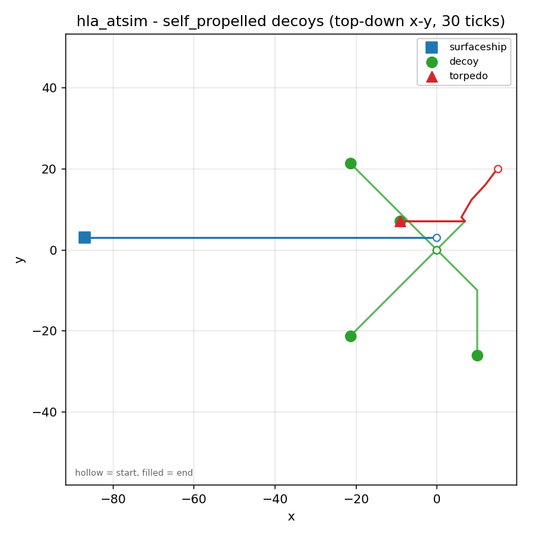
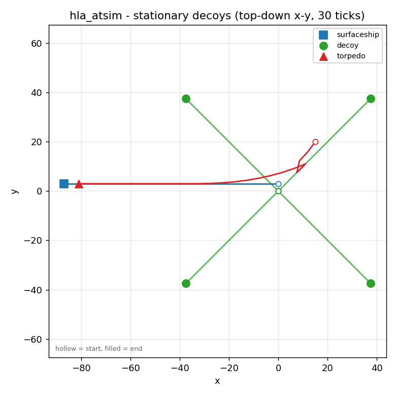
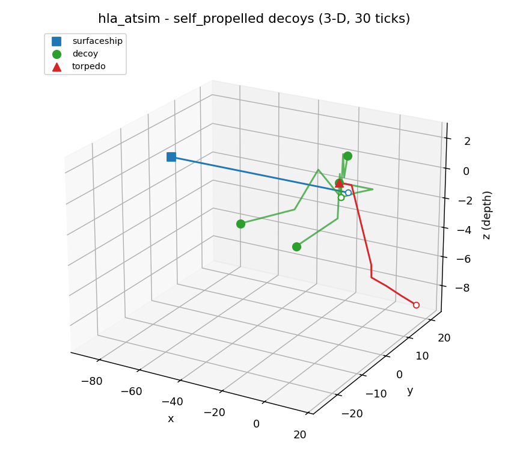
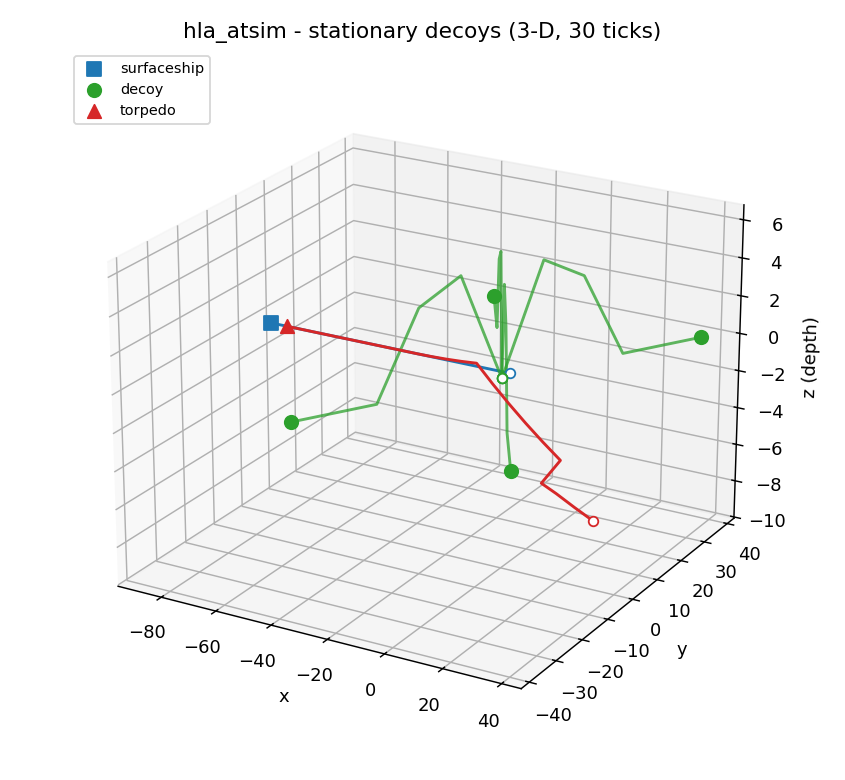
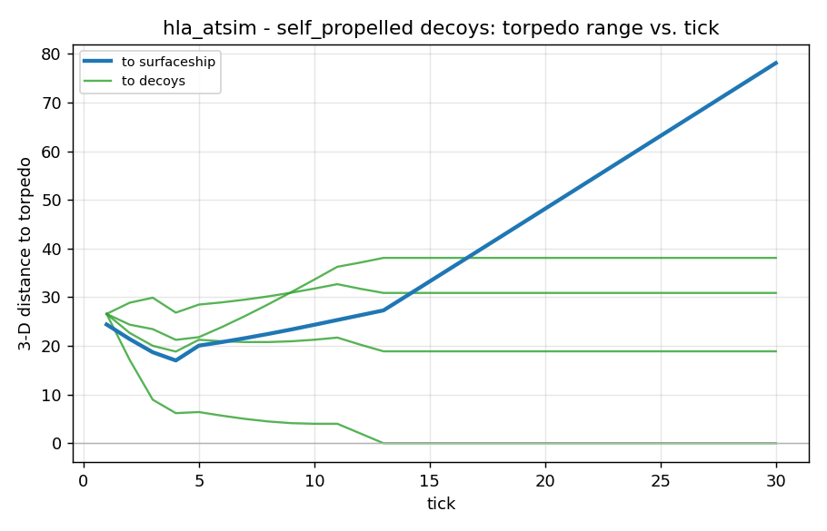
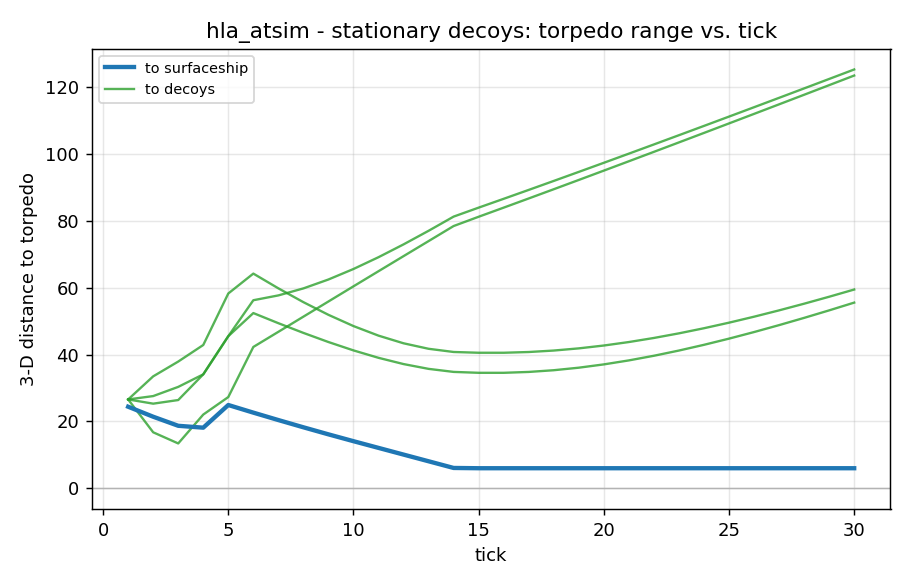

# hla_atsim — HLA co-simulation of the anti-torpedo example

A self-contained HLA/RTI split of `examples/atsim` into **two federates**
(surfaceship + torpedo) that provably reproduces a single-executor
reference run, tick-for-tick and bit-for-bit.

## What's here

| file | role |
|------|------|
| `run_standalone_headless.py` | single `SysExecutor` reference (writes `standalone_<tag>.csv`) |
| `run_hla_inprocess.py` | two federates over the in-process RTI bus (writes `hla_<tag>.csv`) — **no Java needed** |
| `run_hla_pitch.py` | optional live pRTI 1516e run (guarded; writes `hla_pitch_<tag>.csv`) |
| `verify_equivalence.py` | the gate: runs both headless builds and asserts identical CSVs for every scenario |
| `plot_trajectories.py` | headless matplotlib — renders `figures/atsim_<tag>.png` from the CSV |
| `fom/AntiTorpedo.xml` | IEEE 1516-2010 FOM, one `Platform` object class |
| `hla_common.py` | FOM ids, `HLAAttribute` bindings, `ProxySink`, `publish_local` |
| `scenarios/self_propelled_decoy.yaml` | self-propelled decoy scenario (default) |
| `scenarios/stationary_decoy.yaml` | stationary decoy scenario |
| `utils/sim_context.py` | per-federate `SimContext` (replaces the global `ObjectDB` singleton) |
| `utils/sensing.py` | `PositionSnapshot` + frozen/remote proxies (order-independent sensing) |
| `utils/ticking.py` | `commit_tick` — tick-boundary decision commit for determinism |
| `model/`, `mobject/` | atsim models, ctx-injected and made deterministic |

## Run

```bash
python examples/hla_atsim/verify_equivalence.py
# -> MATCH self_propelled: 180 rows
# -> MATCH stationary: 180 rows
```

The gate verifies **both** scenarios and exits 0 only if both are
byte-identical. Select a scenario for the individual run scripts via CLI arg
or the `PYJEVSIM_SCENARIO` env var (defaults to `self_propelled`):

```bash
python examples/hla_atsim/run_standalone_headless.py stationary   # -> standalone_stationary.csv
python examples/hla_atsim/run_hla_inprocess.py stationary         # -> hla_stationary.csv
PYJEVSIM_SCENARIO=stationary python examples/hla_atsim/run_hla_inprocess.py
```

CSVs are named `standalone_<tag>.csv` / `hla_<tag>.csv` where `<tag>` is the
scenario key (`self_propelled`, `stationary`); all generated CSVs are gitignored.

## Two scenarios

Two decoy scenarios ship, selected with `PYJEVSIM_SCENARIO` (or a positional
CLI arg); both mirror the corresponding `examples/atsim` scenario:

| scenario | decoys | behaviour |
|----------|--------|-----------|
| `self_propelled` (default) | 4 self-propelled | decoys run outward on their own headings; the torpedo is seduced onto a moving decoy |
| `stationary` | 4 stationary | decoys hold their drop positions; the torpedo is seduced onto a fixed decoy |

Each scenario is verified **byte-identical** across three execution paths — the
single-process reference and the two-federate HLA co-simulation on both the
in-process bus and a real RTI:

| run script | backend | Java? |
|------------|---------|-------|
| `run_standalone_headless.py` | single `SysExecutor` (reference) | no |
| `run_hla_inprocess.py` | two federates, `InProcessRTI` | no |
| `run_hla_pitch.py` | two federates, **live Pitch pRTI 1516e** | yes (JPype + running CRC) |

For each scenario, `standalone_<tag>.csv` == `hla_<tag>.csv` ==
`hla_pitch_<tag>.csv`, 180 rows, byte-for-byte:

```
MATCH self_propelled: 180 rows
MATCH stationary:      180 rows
```

To reproduce all six runs and the two-scenario gate:

```bash
python examples/hla_atsim/verify_equivalence.py                       # both scenarios, no Java
for s in self_propelled stationary; do
  python examples/hla_atsim/run_standalone_headless.py $s
  python examples/hla_atsim/run_hla_inprocess.py       $s
done
```

## Trajectories

Engagement over 30 ticks. Because the standalone and both HLA runs are
byte-identical, one set of figures represents all three. Regenerate with
`python examples/hla_atsim/plot_trajectories.py` (headless matplotlib) — it
writes three figures per scenario (top-down, 3-D, range-vs-tick).

| view | self-propelled decoys | stationary decoys |
|------|-----------------------|-------------------|
| top-down (x–y) |  |  |
| 3-D (x, y, z depth) |  |  |
| torpedo range vs. tick |  |  |

The surfaceship (blue) flees west while its `Launcher` deploys four decoys
(green); the torpedo (red) starts deep (`z = -9`) and rises as it homes in.

- **Self-propelled decoys — seduction succeeds.** One decoy crosses into the
  torpedo's path; the range plot shows the torpedo→decoy distance collapsing to
  `0` around tick 13 while the torpedo→ship distance grows past `70` — the ship
  escapes.
- **Stationary decoys — seduction fails (here).** The decoys jump to fixed
  offsets away from the torpedo's approach; the torpedo→ship distance instead
  closes to ~`6` and holds — the torpedo runs down the ship's track.

Both outcomes are reproduced identically by the two-federate HLA co-simulation.
(In the top-down/3-D plots, hollow marker = start, filled = end.)

## Why standalone == HLA, deterministically

The only cross-platform coupling in atsim is *sensing* (each Detector read
every other object's position). Two design rules make the split exact and
reproducible, applied identically to both builds:

1. **1-tick position snapshot.** Detectors (and the CommandControl /
   TorpedoControl references) read a frozen snapshot taken at the tick
   boundary — end-of-previous-tick positions — never live mid-tick objects.
   Iteration is sorted by a stable `sense_id`. In HLA the snapshot is fed by
   local objects + peer/decoy positions reflected over the RTI with
   lookahead = 1. See `utils/sensing.py`.

2. **Once-per-tick physics + tick-boundary decision commit.** The atsim
   models mutate shared physics objects inside `output()`; under DEVS
   cascades the order and count of `output()` calls at one instant is
   nondeterministic (`ScheduleQueue.pop()` set-iteration is object-id based).
   We remove every intra-tick race: each Manuever/decoy integrates exactly
   once per tick, and cross-model decisions that touch a peer's physics
   object (heading evasion, pursuit target) are staged as `pending_*` and
   committed at the next tick boundary. Motion in tick `t` therefore depends
   only on the tick number and the frozen inputs — identical in one executor
   or two. See `utils/ticking.py`.

Position exchange is pumped explicitly between `step()` calls
(`publish_local` → `ProxySink`), not through a bound DEVS "uplink" model, so
it reads settled end-of-tick positions and stays outside the tick.

## Optional Pitch run

`run_hla_pitch.py` bridges to a real pRTI 1516e CRC. It is **not** part of
the gate and self-skips unless `jpype`, a JVM, `prti1516e.jar`, and a
reachable CRC are all present:

```bash
set PYJEVSIM_JVM=...\jvm.dll
set PYJEVSIM_JAR=...\prti1516e.jar
python examples/hla_atsim/run_hla_pitch.py
```
