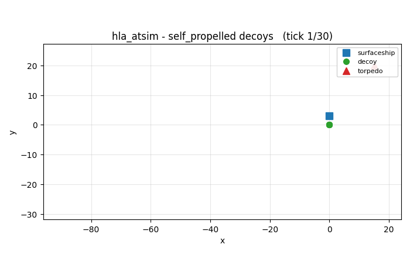
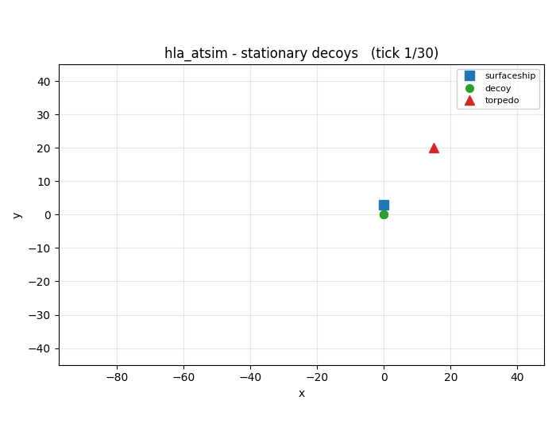
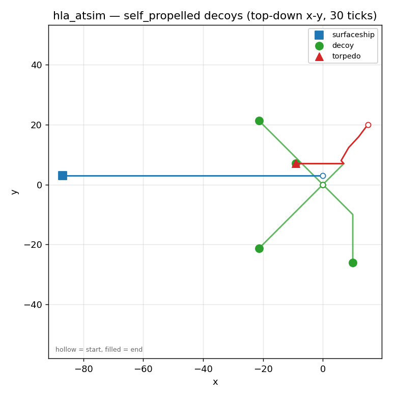
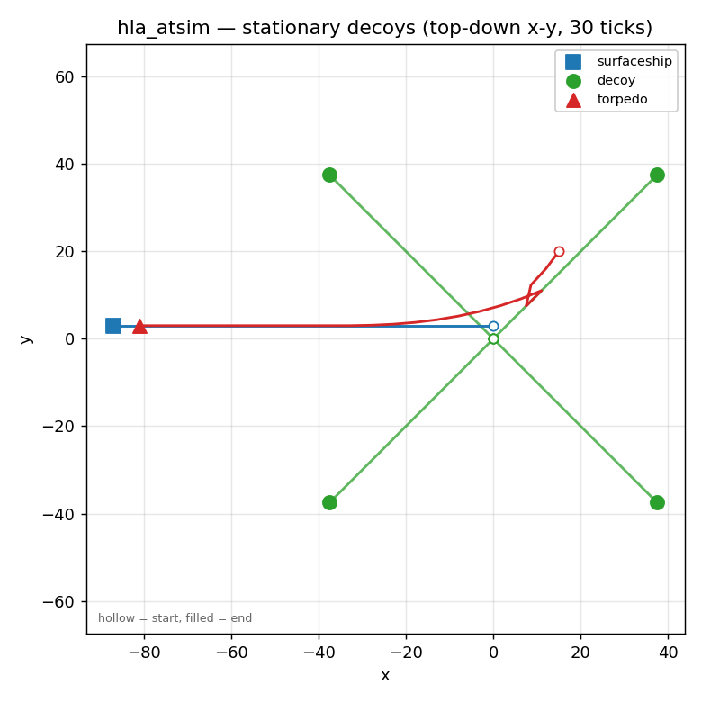
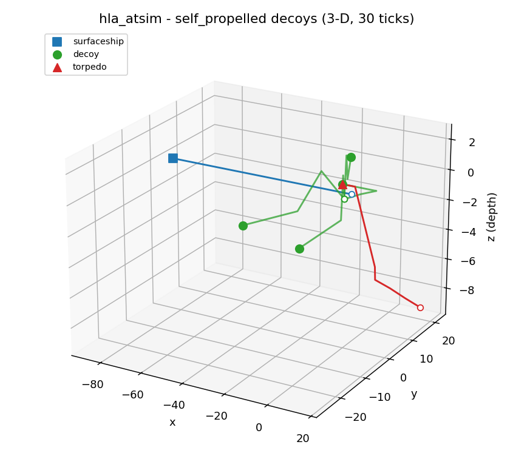
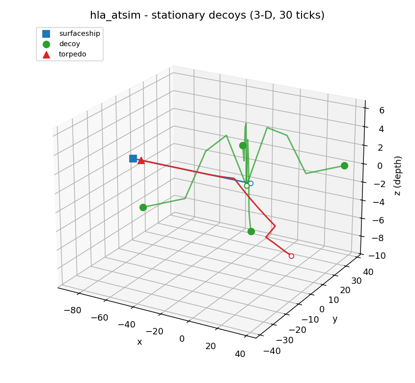
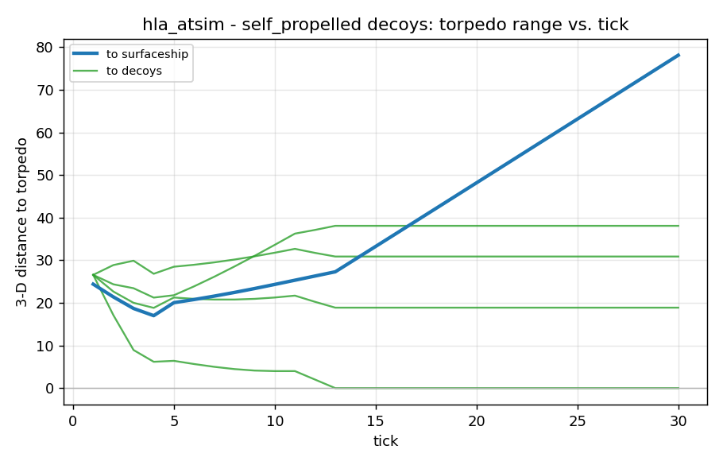
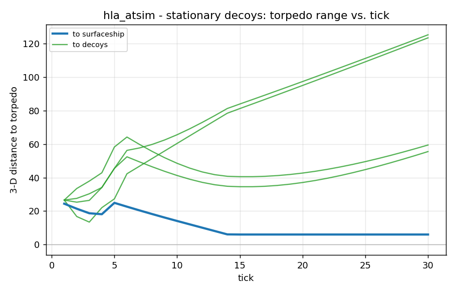

# HLA AT/SIM example

This example splits `examples/atsim` into surface-ship and torpedo federates.
It compares their application-state rows with a committed single-executor
reference at every recorded tick.

## What's here

| file | role |
|------|------|
| `run_standalone_headless.py` | single `SysExecutor` reference (writes `standalone_<tag>.csv`) |
| `run_hla_inprocess.py` | two federates over the in-process RTI bus (writes `hla_<tag>.csv`) — **no Java needed** |
| `run_hla_pitch.py` | optional live 1516e run (guarded; writes `hla_<rti>_<tag>.csv`; `PYJEVSIM_RTI` selects the backend) |
| `run_hla_portico.py` | the same driver against the open-source Portico RTI (writes `hla_portico_<tag>.csv`) |
| `verify_equivalence.py` | compares both headless runs with the committed reference rows |
| `verify_equivalence_rti.py` | compares a selected live RTI (`PYJEVSIM_RTI=pitch\|portico`) with the references; missing toolchain or output is an error |
| `plot_trajectories.py` | headless matplotlib — renders `figures/atsim_<tag>.png` (top-down, 3-D, range) from the CSV |
| `make_animation.py` | headless matplotlib — renders `figures/atsim_<tag>.gif` engagement animation |
| `fom/AntiTorpedo.xml` | IEEE 1516-2010 FOM, one `Platform` object class |
| `hla_common.py` | FOM ids, `HLAAttribute` bindings, `ProxySink`, `publish_local` |
| `scenarios/self_propelled_decoy.yaml` | self-propelled decoy scenario (default) |
| `scenarios/stationary_decoy.yaml` | stationary decoy scenario |
| `utils/sim_context.py` | per-federate `SimContext` (replaces the global `ObjectDB` singleton) |
| `utils/sensing.py` | `PositionSnapshot` + frozen/remote proxies (order-independent sensing) |
| `utils/ticking.py` | `commit_tick` — tick-boundary decision commit for determinism |
| `model/`, `mobject/` | atsim models, ctx-injected and made deterministic |

## Run

```bash
python examples/hla_atsim/verify_equivalence.py
# -> MATCH self_propelled: 180 rows
# -> MATCH stationary: 180 rows
```

The command checks **both** scenarios and exits 0 only if both are
exactly equal to the full committed references in
[`docs/hla-validation/results`](../../docs/hla-validation/results/).
Select a scenario for the individual run scripts via CLI arg or the
`PYJEVSIM_SCENARIO` env var (defaults to `self_propelled`):

```bash
python examples/hla_atsim/run_standalone_headless.py stationary   # -> standalone_stationary.csv
python examples/hla_atsim/run_hla_inprocess.py stationary         # -> hla_stationary.csv
PYJEVSIM_SCENARIO=stationary python examples/hla_atsim/run_hla_inprocess.py
```

CSVs are named `standalone_<tag>.csv` / `hla_<tag>.csv` where `<tag>` is the
scenario key (`self_propelled`, `stationary`); all generated CSVs are gitignored.

## Two scenarios

Two decoy scenarios ship, selected with `PYJEVSIM_SCENARIO` (or a positional
CLI arg); both mirror the corresponding `examples/atsim` scenario:

| scenario | decoys | behaviour |
|----------|--------|-----------|
| `self_propelled` (default) | 4 self-propelled | decoys run outward on their own headings; the torpedo is seduced onto a moving decoy |
| `stationary` | 4 stationary | decoys hold their drop positions; seduction fails and the torpedo continues along the ship's track |

Each scenario has been checked across the single-process reference and the
two-federate HLA co-simulation on the in-process bus and two live RTIs:

| run script | backend | Java? |
|------------|---------|-------|
| `run_standalone_headless.py` | single `SysExecutor` (reference) | no |
| `run_hla_inprocess.py` | two federates, `InProcessRTI` | no |
| `run_hla_pitch.py` | two federates, **live Pitch pRTI 1516e** | yes (JPype + running CRC) |
| `run_hla_portico.py` | two federates, **live Portico 2.1.4** (open source) | yes (JPype + `portico.jar`, no CRC) |

Behavioral equivalence means exact equality of the 180 sorted rows
`(tick, sense_id, "%.10g" % x, "%.10g" % y, "%.10g" % z)`. It does not
compare file headers/newlines, wire bytes, wall-clock timing, or raw RTI
callback order. Successful checks report:

```
MATCH self_propelled: 180 rows
MATCH stationary:      180 rows
```

To run the offline two-scenario check:

```bash
python examples/hla_atsim/verify_equivalence.py  # both scenarios, no Java
```

## Trajectories

Engagement over 30 ticks. Because the checked paths have the same canonical
positions, one set of figures represents their application-state trajectory.
Regenerate the static figures with `python
examples/hla_atsim/plot_trajectories.py` (top-down, 3-D, range-vs-tick per
scenario) and the animations with
`python examples/hla_atsim/make_animation.py` (headless matplotlib).

### Animation

| self-propelled decoys | stationary decoys |
|-----------------------|-------------------|
|  |  |

The surface ship is blue, the decoys are green, and the torpedo is red. The
self-propelled scenario redirects the torpedo to a decoy; in the stationary
scenario the torpedo continues along the ship's track. The GIFs are rendered
from the shared reference trajectories.

### Static views

| view | self-propelled decoys | stationary decoys |
|------|-----------------------|-------------------|
| top-down (x–y) |  |  |
| 3-D (x, y, z depth) |  |  |
| torpedo range vs. tick |  |  |

The surfaceship (blue) flees west while its `Launcher` deploys four decoys
(green); the torpedo (red) starts deep (`z = -9`) and rises as it homes in.

- **Self-propelled decoys.** One decoy crosses the torpedo's path. The
  torpedo-to-decoy distance reaches `0` around tick 13 while the
  torpedo-to-ship distance grows past `70`.
- **Stationary decoys.** The decoys move to fixed offsets from the torpedo's
  approach. The torpedo-to-ship distance approaches about `6` and then holds.

The two-federate comparison produces the same reference rows for both
scenarios. In the top-down and 3-D plots, hollow markers show starting
positions and filled markers show final positions.

## Deterministic comparison design

The cross-platform coupling in this example is position sensing. Two design
rules make the standalone and two-federate runs comparable:

1. **1-tick position snapshot.** Detectors (and the CommandControl /
   TorpedoControl references) read a frozen snapshot taken at the tick
   boundary — end-of-previous-tick positions — never live mid-tick objects.
   Iteration is sorted by a stable `sense_id`. In HLA the snapshot is fed by
   local objects + peer/decoy positions reflected over the RTI with a
   one-caller-tick exchange offset. See `utils/sensing.py`.

2. **Once-per-tick physics and delayed decision commit.** The AT/SIM
   models mutate shared physics objects inside `output()`; under DEVS
   cascades the order and count of `output()` calls at one instant is
   not a stable interface for cross-model decisions. Each maneuver and decoy
   integrates once per tick. Decisions that affect a peer's physics object,
   such as evasion heading or pursuit target, are staged as `pending_*` and
   applied at the next tick boundary. Motion during tick `t` therefore uses the
   same frozen inputs in both runs. See `utils/ticking.py`.

Position exchange is pumped explicitly between `step()` calls
(`publish_local` → `ProxySink`), not through a bound DEVS "uplink" model, so
it reads settled end-of-tick positions and stays outside the tick.

## Optional live-RTI runs

`run_hla_pitch.py` bridges to a live 1516e RTI. It is not part of the default
comparison and skips unless `jpype`, a JVM, and the RTI jar are all
present:

```powershell
$env:PYJEVSIM_JVM = "C:\path\to\jvm.dll"
$env:PYJEVSIM_JAR = "C:\path\to\prti1516e.jar"
python examples/hla_atsim/run_hla_pitch.py            # needs a running CRC
```

The recorded Windows validation used CPython 3.11.15, JPype 1.7.1,
Temurin 11.0.31+11, and Pitch pRTI Free 5.5.2. One CPython 3.14.0 run with
that same JPype/JVM/RTI combination terminated in native code, so CPython
3.11 is the recommended environment for reproducing this particular Pitch
configuration. This observation does not narrow pyjevsim's general Python
support range.

The same driver runs against the open-source **Portico** RTI, which needs no
CRC — only the backend name and the jar change:

```powershell
$env:PYJEVSIM_JVM = "C:\path\to\jvm.dll"
$env:RTI_HOME = "C:\path\to\portico-2.1.4"
$env:PYJEVSIM_JAR = "$env:RTI_HOME\lib\portico.jar"
$env:RTI_RID_FILE = (Resolve-Path "docs/hla-validation/config/portico-jvm.rid").Path
python examples/hla_atsim/run_hla_portico.py          # -> hla_portico_<tag>.csv

$env:PYJEVSIM_RTI = "portico"
python examples/hla_atsim/verify_equivalence_rti.py   # compares both scenarios
```

If `RTI_RID_FILE` is unset, `run_hla_portico.py` selects the same bundled
RID automatically. Its `portico.connection = jvm` setting is for two
federates sharing one Python process and JVM. Other process topologies require
an appropriate custom RID and are not covered by this example. The driver
also fails if either
expected peer reflection is absent at the first time grant, preventing isolated
one-member federations from producing a partial trace that appears successful.
The live verifier terminates a scenario subprocess after 180 seconds by
default; set
`PYJEVSIM_LIVE_TIMEOUT` to an appropriate positive number for a slower RTI.

The [live validation summary](../../docs/hla-validation/results/live-validation-summary.md)
records five consecutive checks against **Portico 2.1.4**
(Temurin 11, JPype 1.7.1), with 180 matching canonical rows per scenario; raw
logs from those historical runs were not retained. Portico delivers the tested
reflections in receive order. The adapter's three-sub-step barrier prevents
next-tick data from appearing early, but current-tick completeness
still depends on configurable `quiet`/`settle` waits; a sufficiently late reflection
can be deferred to the next tick. See
[`portico.py`](../../pyjevsim/hla/backends/portico.py) for the implementation.
